# project name - 'my-happy-place'
## using mind and body self-improvement techniques to balance your self and find Your 'Happy Place'
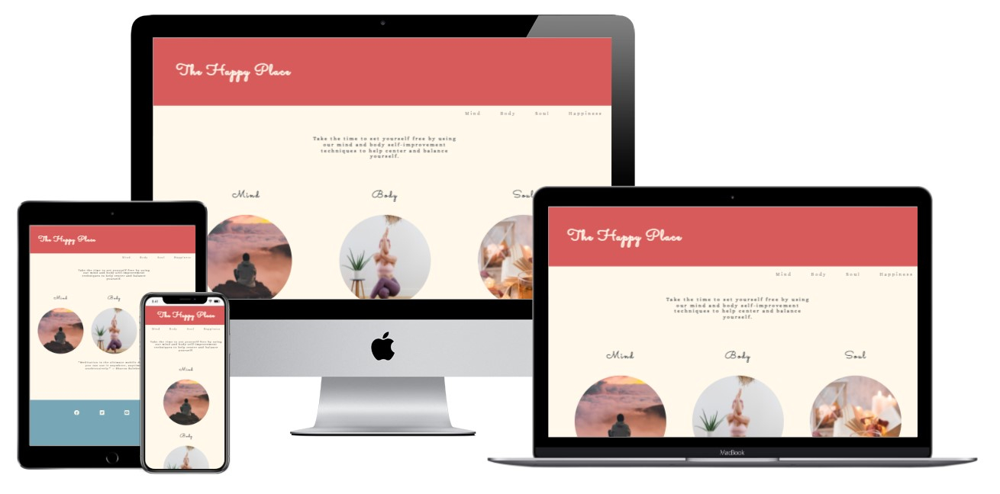

The purpose of this project is to Build a Meditation/Mindfulness/Yoga Website. 
The External user’s site goal is for users that are interested in **learning** body/mind self-improvement techniques and the Site owner's goal is to **teach users** specific body/mind self-improvement techniques.

## UX
The UX for this project will be investigated through the following five planes:

## Strategy Plane:

### Business goals?
The Site owner's goal is to teach users specific body/mind self-improvement techniques

### Who is my target audience?
Target audience are users that are interested in learning body/mind self-improvement techniques from the convience of their home.

### Why are we special?  
There are several other yoga and meditation sites such as *Head Space* and *YouTube* where the user can search for any type of yoga or meditation video they want.

Our advantage is that we take the thinking out of searching for a video to follow and limiting choices for the best videos avalable and displaying it in a mobile friendly, visually apealing site.
We also offer a community where our users can connect with others looking for the same thing. This can be physically in the studio or with a schedueled consultation or meet up.

### Tech considerations?
With todays stressful world we need to be able to relax at a click of a button and we would need to Build a site for our target market.
We would have to consider making the site simple, straigh forward and mobile friendly.

### Why would a user want this?
We not only do we offer the links to the videos and guides but also an opportunity to socialise and meet up with a community of like minded individuals.
We connect users with the choice to come into the studio by contacting the studio and setting up a consultation or to enquire more on yago and meditation time tables.

### What's worth doing?
- Including links to yoga and meditation videos. 
- Details on How to Meditatie and preparing self for a guided meditation.
- Creating a form to be submitted with user information to contact the studio for a consultation or to enquire more about the studio yoga and meditation classes.
- Keeping the site minimal and clean to keep the user in a state of calm while using the site.
- Keeping a neatral light and calm colour pallet to instill a sense of calm for the user.

### Will it add value, and what value will it add? Who's our target audience? Who is our demographic, or our demographics?
Our target audience is most likely females aged from 25-35 entering into full time work with stressful jobs which limits the amount of time spent on themselves and creates a highly stressed and sleep deprived user.  
Having a calming feminan color pallet puts the user at ease for the end of the day. 
Short yoga videos and meditation techniques prepare the user to be one click away from 'their happy place'. 
Also encoraging a meet up or consultation session give the user a sense of community and normality.
To show that there is someone who will listen if needed and there is a place that they can feel comfortable to escape to if nessesary.

## Scope Plane:

### Whats on the table?
Most important features at this stage in no particular order are as follows:

- Home navigation,
- How to meditate,
- Meet up or consulation contact form,
- Links to videos,

Having a calming relaxing home page is the first thing the user will see when opening our site. 
This should be a warm and welcoming front page, I would like to keep with a rounded edge theme and limiting sharp or hard edges on my images as it is a lot more relaxing style choice.
Having more then one image as a circle can be tricky esecially when there are 3 objects involved. I have need to do something else other then *float* in order to achieve this. 
I have chosen to go with *flex-box* to help with the alignment and responsivness of my opening page as it gives me a must more flexible layout options.

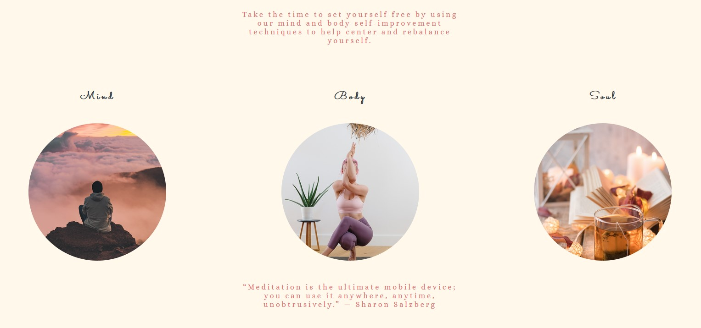

# Features 

For the navigation bar when the user hovers and selects the tab I want the color from the header to extend down onto the selected heading.

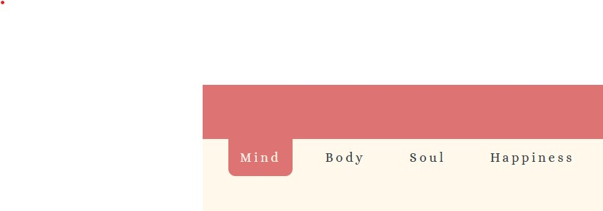

This has caused an issue with the responsive design by having the rounded images. 
The tab closest to the header colour looks strange with the round edge at the very top. 
I may need to isolate this tab in the Media query, if I have the time to play with it.

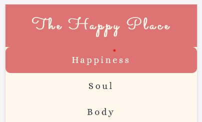

I could include more hot to videos and guidend meditations but the css would be the same and more videos and links can be added at any time as the studio progresses.

We feature a contact form for customers to sign up to schduel a meet up. 
They can meet up for a Yoga or meditation class in the studio or even scheduel a consaltation. 
All the important details have requirement specifications and the email input needs to be valid.

### Key milestones:

- Having navigation bar change from underline simple style to color overlap from header
- Personally having trouble directly targeting certain elements and confusion at which point css proporties affected elements between parent and child elements
- Setting up, parent and child elements and assigning content proporties and container proporties, need help to isolate and define
- Dealing with element hights and width, opposed to padding and margin
- Correctly utilising images without the img element
- Simplist non descriptive class names need to be refactored
- Final clasrification on circle creating radius
- Submit button needed to be isolated with style
- Responsiveness from mobile to desctop needed to change spacing to make style look better
- Need to refactor css proporties with classes to maintain as day code as possible
- Add a enquire more at the bottom of mind and body page to link to contact us page
- Contact Us and form complete and optimized (including message showing there submission has been accepted)
- Test and Review

## Structure Plane:

### Information architecture:
To keep our navigation minimal we will have 4 pages and use a responsive navigation to link between them

Index (happiness) > Mind (Meditation) > Body (yoga) > Soul (Get in touch)

### Principles of Organization:

 Our site is an escape from the munade work load of modern sociaty. not every one hass the time to go to a gym or yoga studio. Not everyone has the time to sift through countless youTube videos too find a good quick class to help de-stress or to sleep better. We take out the thinking of relaxing and create a relaxed calming enviroment that when someone (most likely a woman) opens up the site, they are already calming down from their day and they can select a good video to play inthe background while they unwind from their day.
We do offer a cconnection for when they have a chance where they can either go to a yoga class or schduel a consult with a someone to speak to.
Further information can be found about the studio or the people through the social media sites at the footer if the user wants to explore more.

## Surface plane:

Font: Will be a mix of “Alice” and “Sacramento” a good paring suggesion from 'https://www.pagecloud.com/blog/best-google-fonts-pairings' for comparable and complementary fonts

Color: Primary color will be calm, feminine and relaxing. 
Secondary will be contrasted as bold but saturated to create a readable contrast for important items and the background will be complementary to both the primary and secondary colors. Color scheme was decided using 'https://coolors.co/77a6b6-373f47-dd7373-fbf2c0'. 
At first test there was a contasting issue with the colors chosen but we have now changed the background color to creat more of a contract.

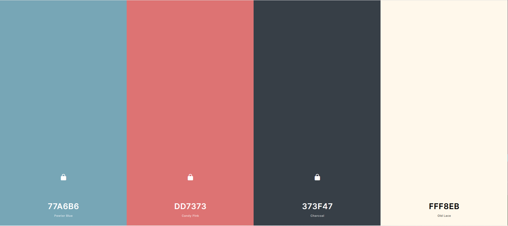

Images have all been selected from 'https://unsplash.com/' a copy right free image site.

# Testing

## HTML validation
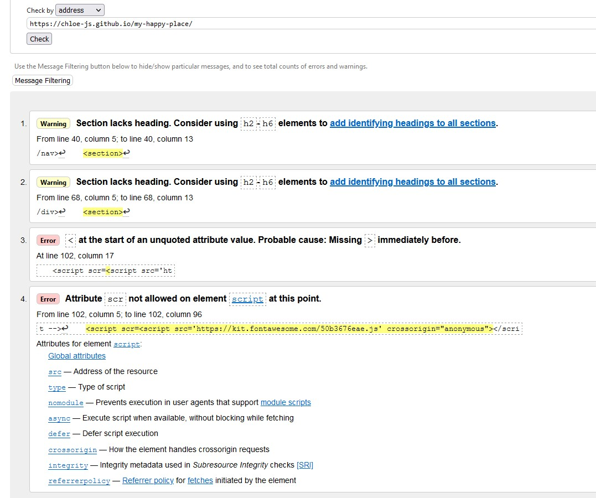

line 102 : incorrect attribute value, <script src-= written twice>, incorrect src spelling
line 40 : lack of headings
line 68 : lack of heading definition 

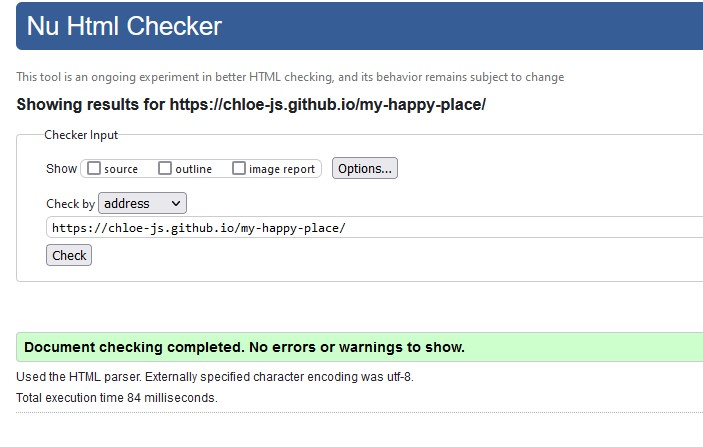

## CSS validation
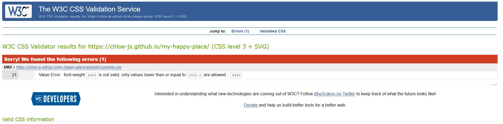
CSS line 21 font weight incorrect value of 2400px, changed all font weight to font-sizes value of REM.
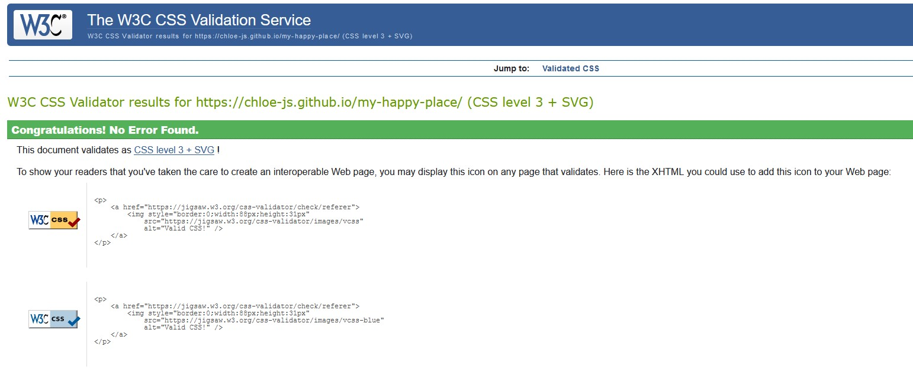

## Lighthouse validation

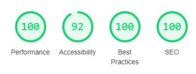

We have utilise lighthouse reports to ensure sufficient use of code and best practices have been applied regarding SEO, Best Practice, Accesssiblity and Performance.
We scored 100% for everything except for Accessability as these was not enought contrast between the background and body.
### Accessibility, 
- H1 low color contrast, change background color of header to darker shade of pink and the Header colour of the text to a whiter cream.

- Body low color contrast, change background color of body to whiter shade of cream and the font colour of the text to all be charcol grey.

- p links additional text needed to define the images in the Index page

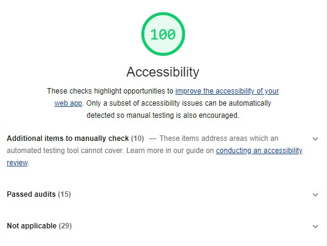

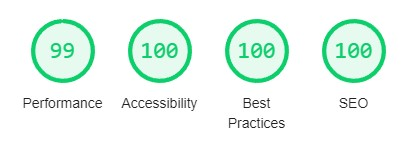

Final Lighthouse reading with all corrections.

# Credits

## Content
- Code for Social MEdia links and select items of the form validation taken from 'Love Running' Project
- [Love Running site link](https://learn.codeinstitute.net/courses/course-v1:CodeInstitute+LR101+2021_T1/courseware/4a07c57382724cfda5834497317f24d5/e6d4cda2bc08458ba94d2092be9bad3a/).
    
    
### Youtube 
- 'https://www.youtube.com/watch?v=sTANio_2E0Q' 20 min Full Body STRETCH/YOGA for STRESS & ANXIETY Relief, from channel 'MadFit'
- 'https://www.youtube.com/watch?v=v7SN-d4qXx0' Bedtime Yoga | 20 Minute Bedtime Yoga Practice | Yoga With Adriene, from channel 'Yoga With Adriene'

### Meditations 
-'https://www.mindful.org/how-to-meditate/' How to Meditate Guide from **Mindful* webiste
- 'https://www.headspace.com/headspace-meditation-app' **Headspace** style and concept

## Images
- Taken from **Unslash** Free stock images

# Unfixed bugs
- The responsive design when we move to mobile the navitation tab at the very top has the same style as the others with rounded edges. The very top tab would look better with a straight edge to show fluidity of the very top tab.
- The order of the tabs seems to be reversed when in the mobile media query, this does not effect the site it would just be better to have the order to be in the reverse